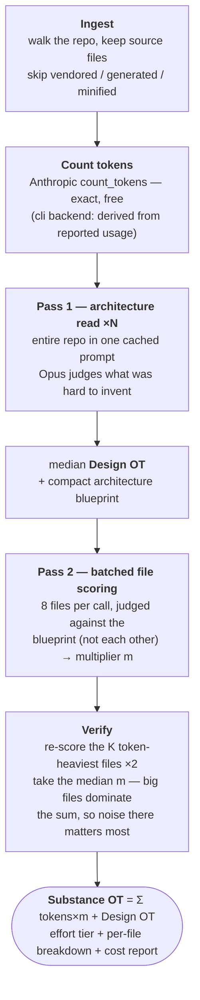

# aiscore

> **Is this AI-trivial vibe code — or did someone actually spend weeks on it?**

`aiscore` puts a number on the **genuine engineering effort** a codebase represents.
Not how clean it looks. Not how modern the syntax is. How hard the *result* would
be to reproduce from scratch.

## The goal

AI assistants have made *lines of code* meaningless as a measure of work. A
20,000-line CRUD app can be an afternoon of prompting; a 900-line solver can be
weeks of thinking. Existing metrics (LOC, stars, commit counts, lint scores) all
measure the wrong thing, and "code quality" graders actively reward the easy-to-
generate stuff.

`aiscore` measures **reproduction difficulty** instead: the estimated effort, in
**OpusTokens (OT)**, for a frontier model (Claude Opus, the fixed reference
instrument) to recreate the project from a blank directory. That definition has
two properties that matter:

- **It can't be gamed by polish.** Reformatting, renaming, or asking a model to
  "clean up" the code doesn't change what the code *does*, so the score doesn't move.
- **It rewards the right thing.** A clunky-but-correct novel algorithm scores
  high; beautiful boilerplate scores ~1× its token count.

The output is a single comparable number plus an effort tier
(*AI-trivial → hours → days → weeks+*) and a per-file breakdown showing *where*
the substance lives.

## How the score is computed

Substance splits into two **disjoint** parts so nothing is double-counted:

```
Substance OT = Implementation OT + Design OT

  Design OT          = cost to INVENT the architecture
                       (decomposition, interfaces, the non-obvious decisions —
                        lives in no single file)

  Implementation OT  = Σ  tokens(file) × m(file)
                       (cost to WRITE each file, GIVEN the design already exists)
```

`m` is a judged effort multiplier per file: generated/boilerplate ≈ 1,
glue/config ≈ 2–4, real domain logic ≈ 10–30, novel algorithms ≈ 50–200.
Because each file is scored *against the architecture blueprint*, spreading a
hard idea across many clean files doesn't lose points — the difficulty is
credited once, in Design OT, and each file is priced for what remains.

### The pipeline



Design choices that keep it honest **and** cheap:

| Choice | Why |
|---|---|
| Opus is the judge; token counts are the only deterministic input | Effort judgment is exactly what LLMs are calibrated for; counts always come from Anthropic, never estimated locally |
| Repo rides in a **cached prompt prefix** (1h TTL) for Pass 1 | N architecture samples re-read the repo at ~0.1× price instead of N× full price |
| Pass 2 sees **only the blueprint**, not the other files | Keeps per-call input small; Pass 1 is instructed to list duplicated/derivable code in the blueprint so copy-paste still scores low |
| Files are **batched** (default 8/call) with strict schemas | Thinking overhead — the dominant cost — is amortized; `strict` tool schemas mean a malformed result fails loudly instead of scoring 0 |
| Largest files first when `-max-files` truncates | Σ tokens×m is dominated by big files; a truncated score is a labeled lower bound, not a biased sample |

## Quick start

You need **Go** (one-time) and **Opus access** — an API key, or a Claude Code login.

```sh
# Recommended — API key: exact token counts, reliable caching, ~3× cheaper
ANTHROPIC_API_KEY=sk-ant-... go run github.com/Lonli-Lokli/ai-score@latest -path .

# Convenience/demo — uses your local `claude` login (subscription)
go run github.com/Lonli-Lokli/ai-score@latest -backend cli -path .
```

### Flags

| Flag | Default | Meaning |
|---|---|---|
| `-path` | `.` | Directory to score |
| `-backend` | `api` | `api` (API key) or `cli` (local Claude Code login) |
| `-max-files` | `40` | Cost guard — keeps the *largest* N files and warns; `0` = score everything |
| `-batch` | `8` | Files per Pass-2 call (batching amortizes thinking overhead) |
| `-n` | `3` | Design-OT samples (median taken) |
| `-verify-top` | `5` | Median-of-3 multipliers for the K token-heaviest files; `0` = off |

## What a run actually costs

Measured on a real project — [`uspamin`](https://github.com/Lonli-Lokli/uspamin),
780 source files / ~4.7 MB, scored top-120 files (52% of bytes) with `-n 1`:

| | `cli` backend (measured) | `api` backend (est. same run) |
|---|---|---|
| Opus calls | 19 | 19 |
| Cache writes | 2.23M tokens (1h TTL, 2×) | ~0.8M (5m TTL, 1.25×) |
| Reported cost | **$24.59** | **~$8** |

The gap is structural: every `claude -p` invocation is a fresh session that
writes its entire prompt (including Claude Code's own ~26k-token system prefix)
to the 1-hour cache at 2× input price, and batch prompts differ so those writes
rarely pay back as reads. **Use `-backend api` for anything beyond a demo.**
Small projects (≤40 files, ≤200k tokens) land in the **$1–3** range on the API.

## Comparing two projects

The whole point. To make A-vs-B meaningful:

1. Use `-backend api` for both (exact counts, same instrument).
2. Use `-max-files 0` for both — or the same cap, knowing both scores become lower bounds.
3. Keep every other flag identical.
4. Compare **Substance OT**; read the Design-OT reasoning and per-file
   multipliers to understand *why* they differ.

The OT unit is pinned to `claude-opus-4-8` (`OT@opus-4.8`) — scores from
different judge models are not comparable.

## Example verdict (uspamin, abridged)

```
  Implementation OT :      7,853,820
  Design OT         :        240,000
  ---------------------------------
  SUBSTANCE OT      :      8,093,820  OT@opus-4.8
  Effort tier       : weeks+
  Coverage          : 52% scanned (120/780 files, 69,870/135,042 LOC)
                      partial scan — the score is a LOWER BOUND

Badge (paste into your README):
  [](https://github.com/Lonli-Lokli/ai-score)
```

**Coverage is part of the verdict.** A score is only comparable when you know
how much of the repo it saw, so every run reports the scanned share of lines of
code, and the emitted badge says either `full scan` or `NN% scanned` — a partial
scan can never masquerade as a whole-repo score.

with per-file discrimination like:

```
shared/path/sokoban.ts          m=70  novel_algorithm   (reverse-generation solver)
shared/path/shapes.ts           m=45  novel_algorithm
builder/editors/path/...        m=3   glue
viewer/players/QuizPlayerView   m=3   boilerplate
```

— the puzzle generators and upload pipeline carry the score; the repeated
experience-plugin surface area prices near its token count. That's the intended
behavior: **substance is where the reproduction difficulty is, not where the
lines are.**

## Status: spike

This directory validates the scoring core before the full tool is built. Known
limitations:

- **File-level chunks** — the real design scores at function/method level.
- **Sequential calls** — no parallelism yet.
- **Placeholder tier thresholds** — *AI-trivial/hours/days/weeks+* cutoffs need
  calibration against a corpus of known-effort projects.
- **Whole-repo Pass 1** — repos over ~1M tokens (≈3.5 MB of source) need
  `-max-files` truncation until hierarchical architecture reading exists.
- SDK shapes verified against `anthropic-sdk-go v1.58.0`; `claude -p` envelope
  fields verified against Claude Code 2.1.x.
